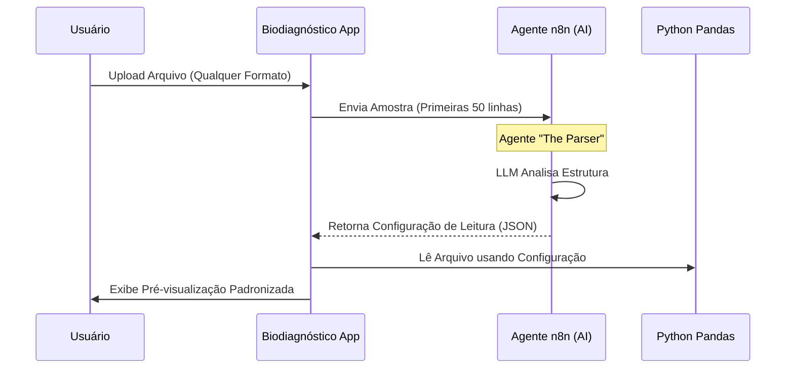

# Especificação Técnica: Sistema de Análise Inteligente de Planilhas

Este documento detalha a arquitetura e implementação dos Agentes de IA para processamento de planilhas no Biodiagnóstico App.

## 🏗️ Arquitetura Híbrida (App + n8n)

O sistema funcionará em um ciclo de **"Vistoria e Normalização"** antes de qualquer análise financeira.



---

## 🤖 Detalhamento dos Agentes

### 1. Agente "The Parser" (Normalizador de Layout)
*O fim dos erros na importação de arquivos.*

#### Problema
Arquivos de laboratórios e convênios mudam de layout, têm cabeçalhos decorativos (logos, títulos) e colunas com nomes variados ("Valor", "Vlr Total", "R$ Liq").

#### Fluxo de Trabalho (Workflow)
1. **Entrada:** O App lê as primeiras 50 linhas do arquivo como texto simples.
2. **Processamento (n8n + LLM):**
   - **Prompt:** "Analise estas linhas. Identifique em qual linha começa o cabeçalho real. Mapeie as colunas para o esquema padrão: `PACIENTE`, `EXAME`, `DATA`, `VALOR`. Ignore linhas de totalização no final."
3. **Saída Esperada (JSON):**
   ```json
   {
     "header_row_index": 4,
     "column_mapping": {
       "Nome do Segurado": "PACIENTE",
       "Procedimento": "EXAME",
       "Vlr. Proc.": "VALOR"
     },
     "notes": "Arquivo do Bradesco Saúde detectado."
   }
   ```
4. **Execução no App:** O `state.py` usa esse JSON para carregar o DataFrame final corretamente via `pd.read_excel(..., header=4)`.

---

### 2. Agente "The Matchmaker" (Conciliador Semântico)
*Resolução de nomes de exames diferentes.*

#### Problema
`HEMOGRAMA COMPLETO` (Compulab) vs `HEMOGRAMA` (SIMUS) vs `HEMO` (Outros). O "exact match" falha e regex é frágil.

#### Fluxo de Trabalho
1. **Entrada:** Lista de exames "Órfãos" (que não casaram no match exato).
2. **Processamento (n8n + Vector Store):**
   - O agente busca na base de conhecimento (Embeddings) qual é o código TUSS/CBHPM oficial daquele termo.
3. **Saída:** Tabela De/Para atualizada.
   - *Exemplo:* "HEMO" -> Código 40304361.

---

### 3. Agente "The Forensic Auditor" (Validador de Regras)
*Detecção de anomalias financeiras.*

#### Problema
Erros que não são de estrutura, mas de lógica. Ex: Exame faturado com valor 200% acima da tabela, ou realizado no domingo (se o lab não abre domingo).

#### Fluxo de Trabalho
1. **Entrada:** DataFrame já padronizado.
2. **Processamento:**
   - O Python envia estatísticas resumidas (não os dados todos, por privacidade/custo) para o n8n.
   - **Prompt:** "Analise esses metadados. O valor médio de glicose triplicou em relação ao mês passado. Identifique a causa."
3. **Saída:** Lista de "Insights" para o Dashboard.

---

## 📅 Plano de Implementação (Faseado)

### Fase 1: Fundação & O Parser (3 Dias)
Esta fase resolve a dor imediata de importar arquivos.

- [ ] **Configuração n8n:** Configurar Webhook e Workflow básico "Layout Detector".
- [ ] **Python Service:** Criar `services/n8n_service.py` para comunicação.
- [ ] **Integração UI:** Atualizar `analise.py` para usar o novo fluxo de upload:
    1. Upload → Loading "IA analisando layout..."
    2. Recebe config → Processa Pandas.
    3. Mostra Preview para confirmação do usuário.

### Fase 2: O Matchmaker (4 Dias)
- [ ] Criar tabela `exam_mappings` no Supabase (Memória de Aprendizado).
- [ ] Implementar fluxo de "Correção Assistida" na UI (onde o usuário confirma a sugestão da IA).

### Fase 3: Dashboard de Insights (3 Dias)
- [ ] Visualização das anomalias encontradas pelo Auditor.

---

## 📝 Próximo Passo
Gostaria de iniciar a **Fase 1** agora? 
Vou configurar o `N8NService` e preparar a UI para enviar a amostra do arquivo para o agente.
